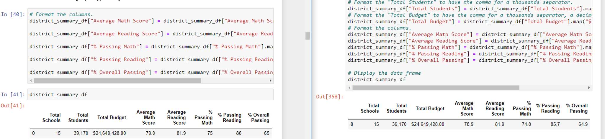
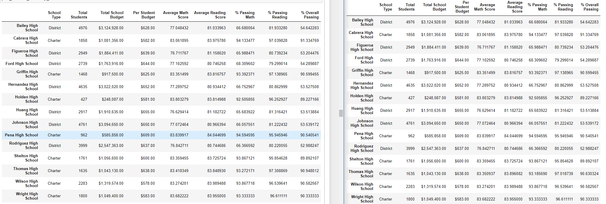
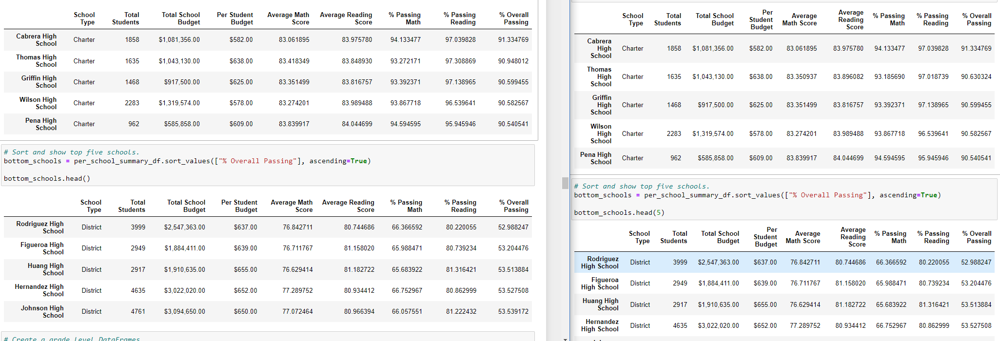
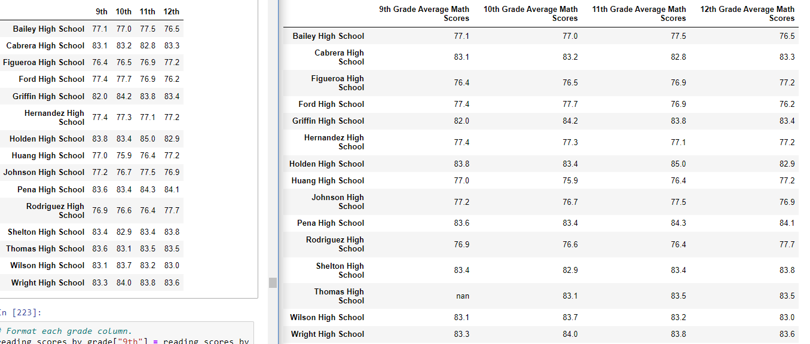
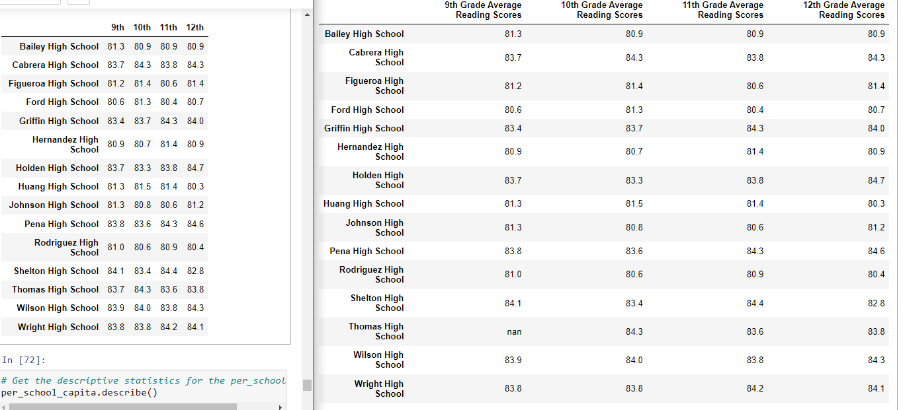
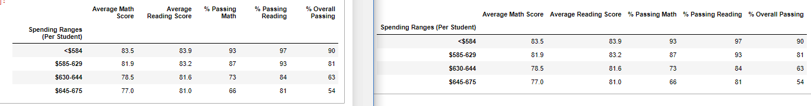
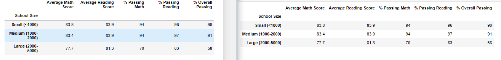
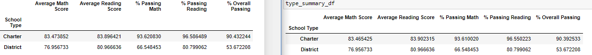

# An Analysis of A List of Schools in A Single School District

### Jupyter Notebook File:
[PyCitySchools_Challenge](PyCitySchools_Challenge.ipynb)

### School District CSV Files:
[schools_complete](Resources/schools_complete.csv)
[students_complete](Resources/students_complete.csv)
[clean_students_complete](Resources/clean_students_complete.csv)

## **Overview**:

The purpose of this analysis was to present the most descriptive conclusions about the school district's list of schools and their students' performances. In this specific case, these conclusions were reached with the added requirement that the analysis remove all data involving the 9th grade student records from the Thomas High School criteria due to concerns about the validity of the data available. This analysis specifically used Pandas with Python language code in the Jupyter Notebook application to read and analyze two CSV file datasheets. Through the Jupyter Notebook file, code blocks were constructed to yield specific summaries of the data analysis and each summary was built upon for increasingly narrow conclusions from the data.

## **Results**:
Overall, following the removal of the invalid 9th grade data of Thomas High School from the various analyses, the conclusions seem to have been only slightly impacted. Though the numbers with more precise results show an impact in the decimal values, with respect to each relevant section of the tables created, the change of dropping the invalid data seems to make little to no impactful change once the values are rounded to be more easily read. As shown in the images and discussed values below, the changes are easiest to spot before the formatting is updated for each summary created. For reference in each image included below, the original conclusions, with the 9th grade data from THS included, is presented on the left and the updated analyses are on the right side.

### District Summary:
The values in the district's summary, for the most part, have each been slightly decreased - with an exception for the "Average Reading Score", which remained the same.
Original Summary (Left) / Updated Summary (Right)

	
### School Summary:
The values in the individual schools summary have, obviously, remained the same for all other schools except Thomas High School. Most of the concusions to the updated analysis have decreased slightly, the exception being the "Average Reading Score", which increased slightly. For the values that are impacted by the updated data for Thomas High School the changes were:
  - Average Math Score: -0.067 points	- Average Reading Score: +0.047	points	- % Passing Math: -0.865 %	- % Passing Reading: -0.29 % 	- % Overall Passing: -0.318 %
Original Summary (Left) / Updated Summary (Right)

		
### Thomas High School Performance Changes:
For the most part, though the removal of the 9th grade data from the Thomas High School analyses has led to lower values in most of the results, Thomas High School has remained the second best school in the district by the "% Overall Passing" value. The updated analysis has caused the best-performing school of Cabrera High School to stand out more with a greater percentage of overall passing students. Despite this, the difference between Thomas High School's initial value in the column and the updated value was less than half a percentage point, making the rounded whole number result for the section the same in both cases for Thomas High School and the same as Cabrera High School's rounded performance value.
Original Summary (Left) / Updated Summary (Right)

### Changes in Math and Reading Scores by Grade:
By removing the 9th grade data for Thomas High School, one of the two values tied for second-best in the "9th Grade Average Math Scores" category is removed - meaning the overall performance of "9th Grade Average Math Scores" across the schools is slightly worse than when the invalid data was included.
Original Summary (Left) / Updated Summary (Right)

Unlike the impact of removing the 9th grade data from the "9th Grade Average Math Scores", the performance of the 9th grade in Thomas High School's "9th Grade Average Reading Scores" was slightly closer to the median of the other values in 9th grade reading scores, meaning there wasn't as big of an impact from removing the data from Thomas High School.
Original Summary (Left) / Updated Summary (Right)

  
### Scores:
With Thomas High School's Per-Student Budget value of $638.00, it falls under the $630-644 per student range, and the impact of removing the 9th grade data made no impact on the results when combined with the other schools in its spending per student range and formatted to round off the numbers.
Original Summary (Left) / Updated Summary (Right)

Similarly, with the student population of 1,635 for Thomas High School, it falls under the "Medium (1000-2000)" school size, and the removal of the 9th grade data made no impact in the resulting analyses when Thomas High School's performance is included with the rest of the data from other schools of similar size and the values are formatted to round off the decimal points.
Original Summary (Left) / Updated Summary (Right)

Once again, when the data for Thomas High School is updated and an analysis is done with its data included with schools of similar type, the results were not different enough to change the values once they were formatted to round off the decimals. For this summary, instead of presenting the rounded values, the unformatted values presented show that there is indeed an impact made from changing the 9th grade values for Thomas High School, but it is indeed very rarely noticable with the final formatting across each analysis.
Original Summary (Left) / Updated Summary (Right)

## **Summary**:
With the removal of the 9th grade scores, the results for each analysis involving this data were impacted very slightly and often to an extent too small to notice when the numbers were formatted for better presentation. The most clear cases of this updated data changing the results of an analysis were:

	1. The "Average Reading Score" value for the school actually improved after the 9th grade's data was removed, marking the only case of a clear improvement for the school by removing an entire grade's data values. In addition to this case being an exception to other changes in the results of this analysis without the invalid data, the change was large enough to impact the formatted values, since this result reflected the school itself instead of factoring in other school's data and making the impact from removing this data less clear.
	 
	2.

	3. 

	4. 
