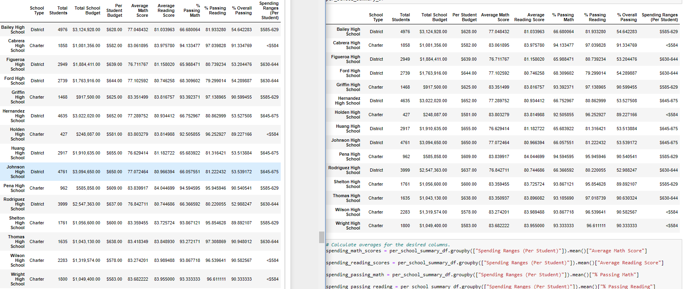

# An Analysis of A List of Schools in A Single School District

### Jupyter Notebook File:
[PyCitySchools_Challenge](PyCitySchools_Challenge.ipynb)

### School District CSV Files:
[schools_complete](Resources/schools_complete.csv)
[students_complete](Resources/students_complete.csv)
[clean_students_complete](Resources/clean_students_complete.csv)

## **Overview**:

The purpose of this analysis was to present the most descriptive conclusions about the school district's list of schools and their students' performances. In this specific case, these conclusions were reached with the added requirement that the analysis remove all data involving the 9th grade student records from the Thomas High School criteria due to concerns about the validity of the data available. This analysis specifically used Pandas with Python language code in the Jupyter Notebook application to read and analyze two CSV file datasheets. Through the Jupyter Notebook file, code blocks were constructed to yield specific summaries of the data analysis and each summary was built upon for increasingly narrow conclusions from the data.

## **Results**:
Overall, following the removal of the invalid 9th grade data of Thomas High School from the various analyses, the conclusions seem to have been only slightly impacted. Though the numbers with more precise results show an impact in the decimal values, with respect to each relevant section of the tables created, the change of dropping the invalid data seems to make little to no impactful change once the values are rounded to be more easily read. As shown in the images and discussed values below, the changes are easiest to spot before the formatting is updated for each summary created.

### District Summary:

	- Original District Summary: 
	- Updated District Summary:
### School Summary:
  

	- Original School Summary:
	- Updated School Summary:
	
### Thomas High School Performance Changes:
  

	- Original performance of Thomas High School:
	- Updated performance of Thomas High School: 

### Changes in Math and Reading Scores by Grade:
  

	- Change in math and reading scores by grade -- increase/decrease in overall performance
  
### Scores:

	- Scores by school spending -- better or worse with the decreased population reference?
  

	- Scores by school size -- better or worse with decreased population size?
  
  
	- Scores by school type -- ?

## **Summary**:
With the removal of the 9th grade scores, the school district's analysis

### *Changes In Data*:  
= = In-Depth Analysis of 4 different changes to the analysis previously not detailed = =

	1. 
	 
	2.

	3. 

	4. 
